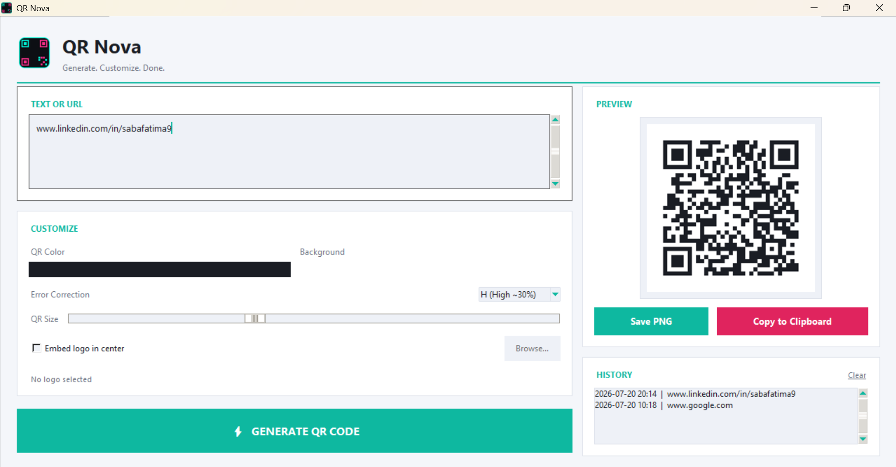
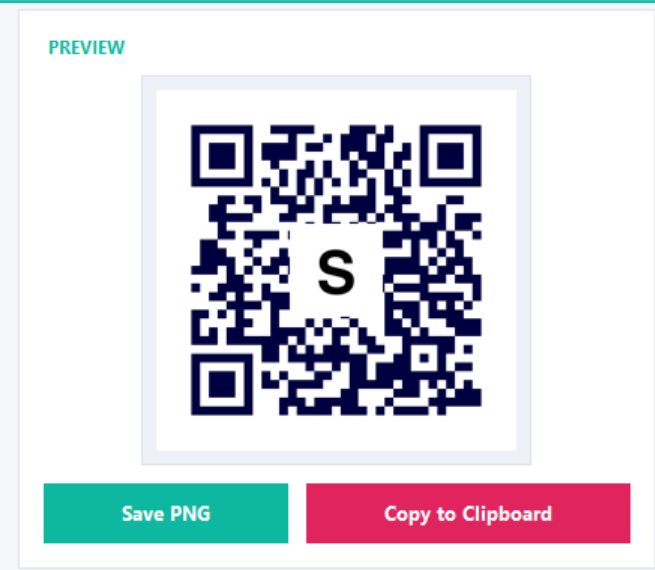
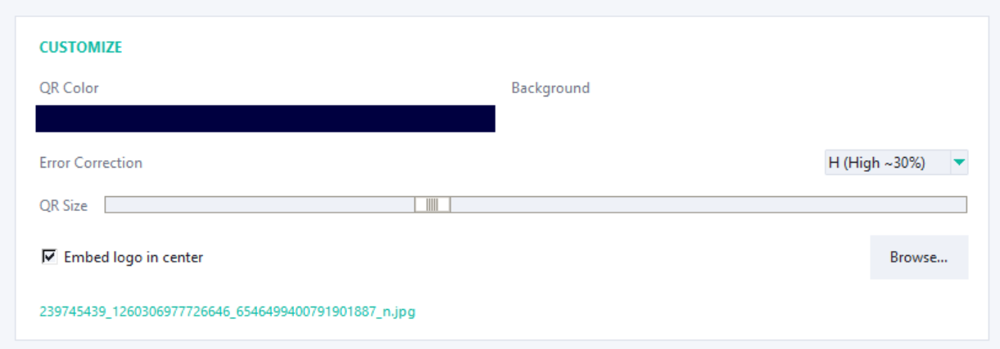
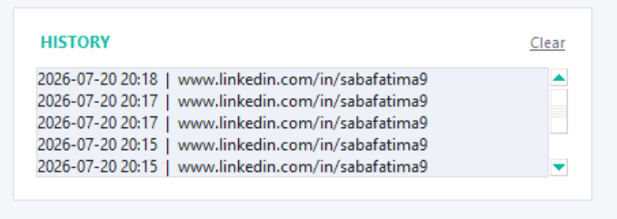

<div align="center">


</div>

---

## 🎯 Overview

**QR Nova** is a sleek, dark-themed **QR Code Generator** built entirely in **Python** using **Tkinter**. Type in any text or URL and instantly generate a fully customizable QR code — pick your own colors, error correction level, and even embed a logo right in the center. Save your codes as PNG, copy them straight to your clipboard, and revisit anything you've generated with the built-in history panel.

---

## 🎬 App Preview

<div align="center">

| 🏠 Main Window | ⚡ Generated QR | 🖼️ Logo Embed |
|:---:|:---:|:---:|
|  |  |  |

| 🎨 Color Customization | 🕘 History Panel |
|:---:|:---:|
|  |  |

</div>

---

## ✨ Features

<table>
<tr>
<td width="50%" valign="top">

### ⚡ Core Generation
- 📝 Text / URL → QR code, instantly
- 🎨 Custom foreground & background colors
- 🛡️ Adjustable error correction (L / M / Q / H)
- 📏 Adjustable QR size
- 🖼️ Optional logo embedding, center-aligned

</td>
<td width="50%" valign="top">

### 💾 Workflow & Experience
- 💾 Save as PNG anywhere on disk
- 📋 One-click copy to clipboard (Windows)
- 🕘 Auto-saved history, double-click to reload
- 🌌 Custom-drawn neon app icon — no external assets
- 🖥️ Clean, unique dark UI with neon accents

</td>
</tr>
</table>

---

<div align="center">

</div>

## 🛠️ Tech Stack

<div align="center">

</div>

| Layer | Technology |
|---|---|
| Language | Python 3.10+ |
| GUI Framework | Tkinter (custom dark theme, hand-rolled widgets) |
| QR Engine | `qrcode` |
| Image Processing | `Pillow` (logo embed, icon generation, previews) |
| Clipboard | `pywin32` (Windows) |
| Packaging | `PyInstaller` (.exe build) |

---

## 🚀 Getting Started

**1. Clone the repo**
```bash
git clone https://github.com/Sabafatima9/qr-nova.git
cd qr-nova
```

**2. Install dependencies**
```bash
pip install -r requirements.txt
```

**3. Run the app**
```bash
python main.py
```

> **Tip:** double-click any entry in the History panel to reload that QR code back into the preview.

---

## 📦 Building a Standalone .exe

```bash
pip install pyinstaller
pyinstaller --onefile --windowed --name "QRNova" main.py
```

Your executable will be in `dist/QRNova.exe` — no Python install required to run it.

---

## 🏗️ Project Structure

```
qr-nova/
├── main.py               # 🎮 Entry point — full app logic
├── requirements.txt       # Dependencies
├── screenshots/           # README preview images
│   ├── main_window.png
│   ├── qr_preview.png
│   ├── logo_embed.png
│   ├── color_picker.png
│   └── history_panel.png
└── README.md              # 📖 You're here
```

> The app's own logo/icon and generation history are stored automatically in `~/.qrnova/` at runtime — no assets folder needed for that part.

---

## 🧠 How It Works

| Concept | Implementation |
|---|---|
| **QR Generation** | `qrcode.QRCode()` with configurable `error_correction`, `box_size`, and `border` |
| **Custom Colors** | `make_image(fill_color=..., back_color=...)` from user-picked hex values |
| **Logo Embedding** | Pillow resizes logo to ~22% of QR width, pastes on a white backing at center for scan reliability |
| **Clipboard Copy** | Image converted to raw DIB bytes via `BMP` encoding, pushed with `win32clipboard` |
| **History** | Every generation auto-saves a PNG + JSON entry to `~/.qrnova/history/` |

---

## 📈 Roadmap

- [ ] Batch generation from a CSV list of texts/URLs
- [ ] Export as SVG / PDF in addition to PNG
- [ ] Built-in scan test to verify readability after logo embedding
- [ ] Drag-and-drop text/CSV files onto the window
- [ ] Remember last-used colors & settings between sessions

---

<div align="center">

### ⭐ Star this repo if QR Nova made your workflow easier!


</div>
